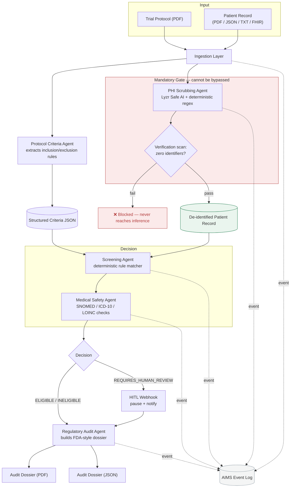

# lyzr-clinical-screen

**Governed Trial Screening** — a multi-agent pipeline that screens patients against clinical trial protocols with mandatory PHI redaction, deterministic eligibility rules, and an FDA-style audit trail.

Built on the Lyzr Agent API and Lyzr Safe AI, with a FastAPI backend and a React frontend, fully containerized with Docker Compose.

---

## What it does

Clinical trial coordinators manually cross-reference 100+ page protocols against unstructured patient records — a slow, error-prone process where a missed threshold can enroll an ineligible patient, or exposed PHI can create a compliance incident.

`lyzr-clinical-screen` automates this safely:

1. **Ingests** a trial protocol (PDF) and a patient record (PDF, JSON, plain text, or FHIR Bundle)
2. **Extracts** structured, machine-checkable eligibility criteria from the protocol using an LLM agent, validated against a known field schema so nothing gets silently hallucinated
3. **Scrubs PHI** — a hard, non-bypassable gate. Names, DOB, MRNs, addresses, phone/email are stripped before any patient data reaches an LLM call, a log line, or storage
4. **Screens deterministically** — eligibility is decided by rule evaluation against structured criteria, never by asking an LLM to "judge" a patient
5. **Cross-checks medical safety** against clinical ontologies to catch terminology mismatches the rule matcher alone might miss
6. **Generates an audit dossier** — every criterion evaluated, its protocol section citation, the result, and a confidence score, exported as PDF and JSON
7. **Streams every step** to an AIMS-style event log for full traceability
8. **Pauses for human review** automatically when confidence drops below threshold

---

## Architecture



**Design principles baked into the pipeline:**

- **Determinism over vibes** — eligibility decisions come from rule evaluation against structured criteria, never a raw LLM judgment call
- **PHI never touches inference unmasked** — the scrubbing gate is enforced in code, not left to convention
- **Every decision is traceable** — an event is logged for every pipeline step, cited back to the exact protocol section
- **Clean separation** — Lyzr Environment / Agent / Inference stay isolated in `agents/orchestration/`; backend code never calls an LLM directly

---

## Tech stack

| Layer | Technology |
|---|---|
| Agent orchestration | Lyzr Agent API, Lyzr Safe AI |
| Backend | FastAPI, SQLite |
| Frontend | React + Vite, TypeScript |
| PDF generation | ReportLab |
| PDF/text parsing | pdfplumber, pypdf |
| Containerization | Docker, Docker Compose, nginx |

---

## Repo structure

```
lyzr-clinical-screen/
├── agents/
│   ├── protocol_criteria_agent/     # extracts inclusion/exclusion rules
│   ├── phi_scrubbing_agent/         # Safe AI redaction + verification gate
│   ├── screening_agent/             # deterministic eligibility matcher
│   ├── medical_safety_agent/        # ontology cross-checks
│   ├── regulatory_audit_agent/      # dossier generation
│   └── orchestration/               # pipeline wiring + shared state
├── backend/
│   ├── app/
│   │   ├── main.py
│   │   ├── api/                     # ingest, screen, audit, hitl, aims
│   │   ├── services/                # lyzr_client, ingestion, aims_stream,
│   │   │                            # hitl_webhook, fhir_converter
│   │   ├── models/
│   │   └── db/                      # SQLite storage
│   └── tests/
├── frontend/
│   └── src/
│       ├── pages/                   # Upload, ScreeningResults, AuditDossier, AimsDashboard
│       └── api/                     # backend client
├── data/
│   ├── sample_protocols/
│   ├── synthetic_ehr/
│   ├── synthetic_ehr_fhir/
│   └── audit_dossiers/
├── Dockerfile                       # backend
├── frontend/Dockerfile              # frontend (nginx)
├── docker-compose.yml
└── .env.example
```
---

## Running it

### With Docker (recommended)

```bash
cp .env.example .env   # fill in your Lyzr keys
docker compose up --build
```

- App: `http://localhost:5173`
- API: `http://localhost:8000`
- Health check: `http://localhost:8000/health`

### Without Docker

**Backend:**
```bash
cd backend
pip install -r requirements.txt --break-system-packages
uvicorn backend.app.main:app --reload --port 8000
```

**Frontend:**
```bash
cd frontend
npm install
npm run dev   # proxies API calls to localhost:8000
```

---

## API reference

| Method | Path | Purpose |
|---|---|---|
| `GET` | `/health` | Service health check |
| `POST` | `/ingest/protocol` | Upload and parse a protocol PDF |
| `POST` | `/ingest/patient` | Upload and normalize a patient record (PDF/JSON/TXT/FHIR) |
| `POST` | `/screen/extract-criteria` | Extract structured eligibility criteria from a protocol |
| `POST` | `/audit/generate` | Run the full pipeline and generate a dossier |
| `GET` | `/audit/{dossier_id}` | Fetch dossier as JSON |
| `GET` | `/audit/pdf/{dossier_id}` | Fetch dossier as PDF (inline preview + download) |
| `GET` | `/hitl/pending` | List patients paused for human review |
| `POST` | `/hitl/{dossier_id}/resolve` | Approve or reject a paused review |
| `GET` | `/aims/events` | Live pipeline event trail, optionally filtered by patient |

---

## Environment variables

| Variable | Required | Description |
|---|---|---|
| `LYZR_API_KEY` | Yes | Lyzr Agent API key |
| `LYZR_AGENT_ID` | Yes | Protocol Criteria Agent ID |
| `LYZR_INFERENCE_URL` | Yes | Lyzr inference endpoint |
| `LYZR_USER_ID` | Yes | Lyzr account user ID |
| `LYZR_SAFE_AI_KEY` | No | Enables the Lyzr Safe AI redaction pass (deterministic scrubbing still runs without it) |
| `LYZR_SAFE_AI_URL` | No | Lyzr Safe AI redaction endpoint |
| `HITL_WEBHOOK_URL` | No | External webhook fired on low-confidence/review-required decisions |
| `HITL_CONFIDENCE_THRESHOLD` | No | Confidence floor that triggers a pause (default `0.90`) |
| `PHI_TOKEN_SALT` | No | Salt for one-way patient pseudonym tokens |
| `BACKEND_PORT` | No | Defaults to `8000` |

---

## Testing

```bash
pytest backend/tests/ -v
```

Covers ingestion, PHI scrubbing and verification, deterministic screening edge cases (washout periods, exclusion priority), full end-to-end runs across multiple synthetic patients, and the HITL/AIMS endpoints.


